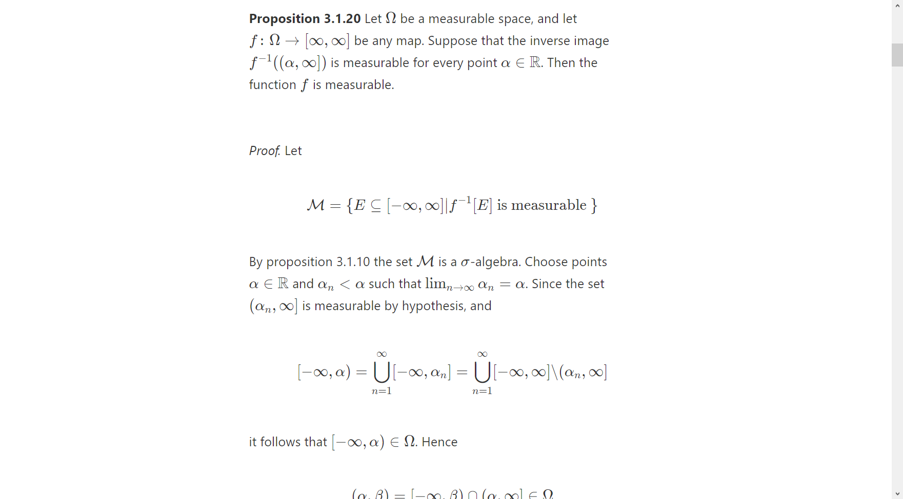

# latex to html
This is an alpha version of a compiler from latex to html. It's super slow and near to 0 documentation, but it looks kind of great :). If you need any help with the project write an issue and i will try to assist you.

# installation 
REQUIREMENTS:  
 - pdf2image (pip install pdf2image)
 - if you want diagrams to be drawn you need miktex (link: https://miktex.org). Be sure that pdflatex is in your path. Aka you can compile latex code with the pdflatex command. - You also can compile stuff by hand instead. The programm generates latex code for the package tikz. In case miktex doesn't work you will need to compile That latex code in the output folder byhand to an pdf and then convert the pdf to png. The function below converts a pdf to an png image :) 
```python
from easylatex2image_core import convert_pdf
convert_pdf("output/something_001",dpi=1000,img_type="PNG")
```

# usage
USAGE: python main.py path/to/folder

This folder must contain:

1. the main tex file called input.tex
2. a bibliography called bibliography.bibtex - make it empty if you are not citing anyone
3. a discription called discription.txt
4. a article_header called article_header.txt 

the article_header is in a relativly simple file format just look at the given Example.
DEFAULT_PACKAGES_AND_COMMANDS.txt contains all packages that are relevant for figures. Commands are not so important in our cases since they are already applied inplace.


If you are using avast you might run into problems with miktex. just add the pdflatex command as an expection and you should be good to go. Or try rebooting.

Additionally if you are running the code with miktex you will probably need to press r and enter some times. when the compiler ask you something.

# used code:
we are using distill for styles since it looks really good https://github.com/distillpub/template
we are using katex for visualization of equations https://github.com/KaTeX/KaTeX


# example
The example is from [Markus Pflaum](https://www.colorado.edu/math/markus-pflaum)

Website

http://www.libermath.org/FANCyProject/viewpdf.html


# notes
For extremely Large files it is best to split everything up into multiple websites. This ensures that the website is loaded fast.